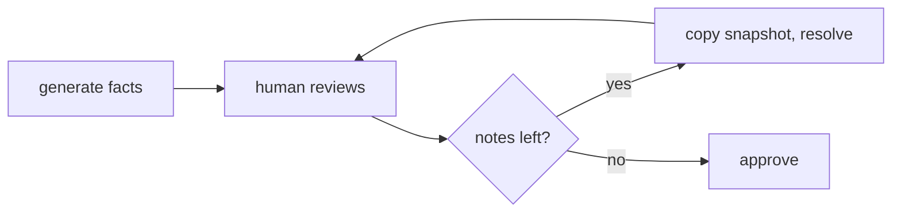

# Mermaid diagrams draw themed, loaded only when needed

The 3.5 MB renderer is fetched lazily the first time a diagram appears,
the SVG takes its colors from the viewer's tokens, and diagram text is
not selectable (comments anchor to the fact source, not the drawing).
