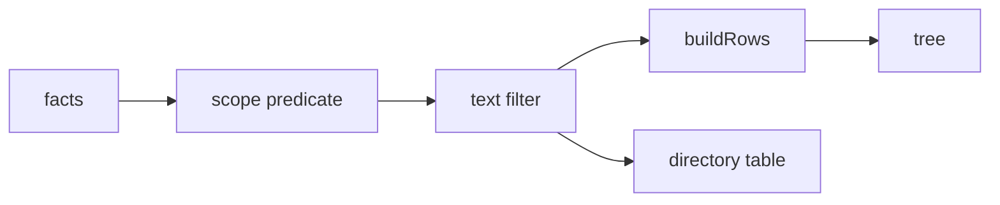

# One pipeline scopes everything the eye can reach

The scope is a predicate feeding the same pipeline the text filter
already used, and the pipeline's output feeds every surface:

So empty directories vanish, ancestor chains survive and force-expand,
j/k walk only the scoped rows ("next changed fact" costs no new key),
and the directory table always mirrors the tree — including ghost rows.
GitHub shipped the opposite for three years (tree filtered, diffs not)
and spent 2025 walking it back; the scoped-view mismatch class of bug
is designed out here rather than fixed later. The status line under
the header reads the scope ("3 changed since snapshot 1"), while the
header's reviewed count stays global — two numbers, two labels, never
a silent disagreement.
