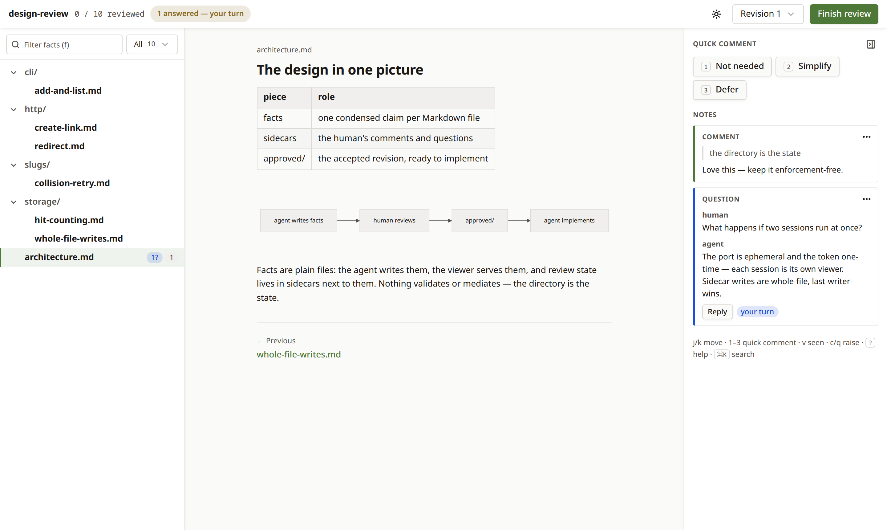

# Gloss

**Fact-first review ergonomics for agent-built software.** Gloss turns
whatever your agent built into a fact tree you review — comment to
change it, ask to understand it, approve to build it.



## How it works

1. Point the skill at anything — a feature, the recent changes, a
   design doc, a whole repo. Your prompt is the scope.
2. The agent condenses what it finds into a **fact tree**: small,
   decidable claims, each carrying the evidence to judge it —
   screenshots, transcripts, probes captured from the running app —
   so you never read the source.
3. You review with the moves you know from code review. **Comment**
   on a fact to change the design: the agent resolves every comment
   in the next revision of the tree. **Ask** to understand: the agent
   answers in the thread, live, while you keep reading. Notes on the
   overview, the tree's front page, speak to the review as a whole —
   its altitude, its focus, or a request for a cold read.
4. When the tree says what you mean, approve it. The approved design
   is what the agent implements.

## Install

```sh
npm install -g gloss-review          # `gloss` on PATH (Node 18+)
gloss skill install --global         # or --agents for .agents/skills
```

The install is the only time you touch the CLI — your agent drives
everything else, including the viewer.

## Use

Invoke the skill with whatever you want reviewed:

```
/gloss all the pages, components, and fields — i want to know what info we display to users
/gloss the recent changes in this session
/gloss the v2 design
```

Plain words work too: "review the design of the checkout flow"
triggers the skill the same way.

[ARCHITECTURE.md](ARCHITECTURE.md) documents the conventions the
skills and the viewer share.

## Develop

Building from source requires [Bun](https://bun.sh):

```sh
bun install && bun run build     # → dist/gloss.js (self-contained)
bun link                         # use your working copy as `gloss`
bun test                         # unit tests
bunx playwright test             # drives a real session in chromium, incl. visual baselines
bun run e2e                      # scripted end-to-end on a disposable fixture repo
```

MIT licensed.
